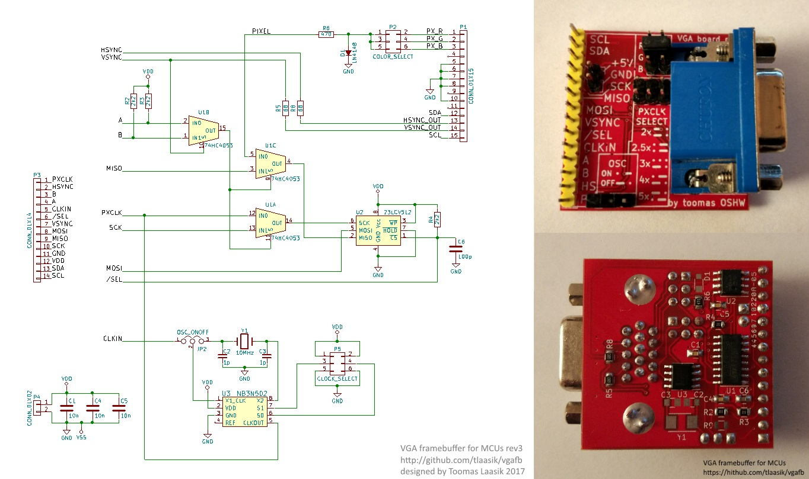
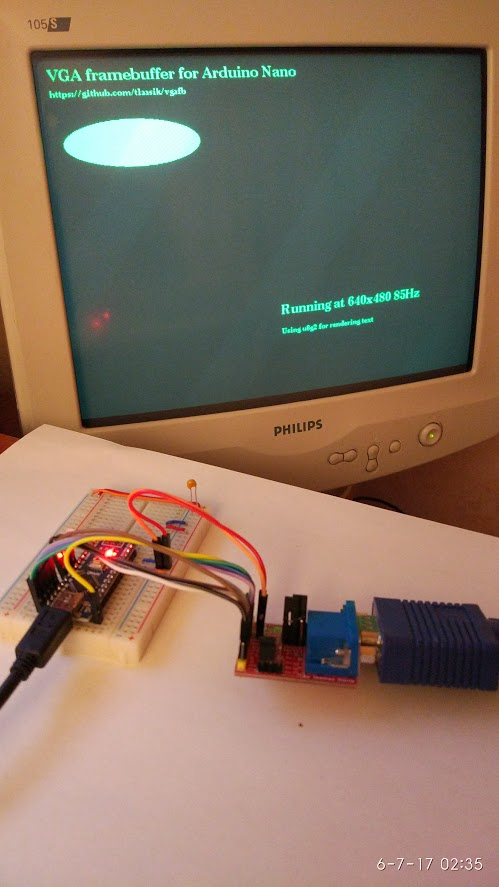

# VgaFB

Minimalistic VGA framebuffer hardware and software for microcontrollers (right now only tested on Arduino Uno and Nano).

## Features
* simple hardware (just 3x2:1 mux and 64KB SPI memory chip), but just enough to have low CPU utilization
* has integraion with high level u8g2 and u8x8 API. These provide monochrome font and graphics rendering
* supports 2 colors: black and a color selected by RGB jumper
* up to 640x480 resolution (64KB address space, 1bit per pixel)
* fast screen clear and fast vertical scrolling
* (optional) generates pixel clock by multiplying MCU clock by 2x 2.5x 3x 4x or 5x
* (optional) or generates pixel clock with own oscillator 20MHz 25MHz 30Mhz 40MHz 50MHz. MCU should use it



## Usage
1. Decide how to generate pixel clock, this may limit what resolutions are available. For example, Arduino may run at 16MHz and generate 8MHz that is fed into CLKIN. Then using 2.5x multiplier 20MHz pixel clock is generated suitable for 400x300@60Hz and 256x256@60Hz modes
2. Wire this schematic together with your Arduino board or chip
3. Download [arduino_lib/](arduino_lib/) and place the contents where your arduino libraries are (usually c:\Users\<username>3\Documents\Arduino\libraries\) or directly in your project folder
4. See [arduino_lib/examples/TextOnScreen_8x2g.ino](arduino_lib/examples/TextOnScreen_8x2g.ino)

List of modes supported (format tells screen width and height, refresh rate and required pixel clock)
* vgamode_400x300_60Hz_20MHz
* vgamode_256x256_60Hz_20MHz
* vgamode_640x480_75Hz_32MHz
* vgamode_320x240_75Hz_16MHz
* vgamode_640x400_85Hz_32MHz
* vgamode_320x200_85Hz_16MHz
* vgamode_640x480_60Hz_25MHz
* vgamode_320x240_60Hz_12_6MHz
* vgamode_160x120_60Hz_6_3MHz

Wiring to Arduino Nano
```
vgafb  ardu_nano
-------------------------------------
SCL    -       monitor I2C DDC clock, no need to connect
SDA    -       monitor I2C DDC data, no need to connect
+5V    +3..5V
GND    ground
SCK    D13     SPI clock in
MISO   D12     SPI data out
MOSI   D11     SPI data in
VSYNC  D10     vertical sync in
/SEL   D4      SPI memory chip select in
CLKIN  D3      clock in, it's multiplied to get pixel clock (right now VgaFB_Begin configures it to 8MHz)
A      D9      mode in if normal vsync, leave hi-z or drive high if inverted vsync
B      D8      mode in if inverted vsync, leave hi-z or drive high if normal vsync
HS     D5      horizontal sync in
PX     -       pixel clock out (without clock mult. chip it's pixel clock in)

/SEL, A and B pins can be assigned elsewhere on Arduino Nano. Other pins are fixed due
to hardware resources like PWM and SPI tied to specific pins.
```

## Example code
```C
#include <U8x8lib.h>
#include <SPI.h>
#include <VgaFB_u8x8.h>

U8G2_VGAFB_400X300_60Hz_20MHz_GENERIC_1_VGAFBBUS u8g2(U8G2_R0, /*mul/div=*/5, 4, /* cs=*/ 4, /* a=*/ 9);

// Generate 8MHz that will be multiplied by 2.5 (set by jumpers) to get 20MHz pixel clock.
// Since Arduino itself runs at 16MHz we told in u8g2 constructor that the multiplier is 1.25
void setupClockGen() {
	OCR2A = 0;
	TCCR2A = _BV(WGM21) | _BV(COM2B0); // toggle B on compare (pin 5, Arduino port: D3)
	TCCR2B = 1; // prescale 1
	pinMode(3, OUTPUT);
}
void setup() {
	setupClockGen();
	u8g2.begin();
}
void loop() {
	u8g2.firstPage();
	do {
		u8g2.setFont(u8g2_font_ncenB14_tr);
		u8g2.drawStr(0, 20, "VGA framebuffer for Arduino Nano");
		u8g2.drawStr(130, 260, "Running at 400x300 60Hz");
		u8g2.setFont(u8g2_font_ncenB08_tr);
		u8g2.drawStr(130, 280, "Using u8g2 for rendering text");
		u8g2.drawStr(0, 40, "https://github.com/tlaasik/vgafb");
		u8g2.drawFilledEllipse(100, 100, 90, 30);
	} while (u8g2.nextPage());
	
	_delay_ms(4000);
	VgaFB_Scroll(u8g2.getVgaFB(), 300);
	_delay_ms(800);
}
```

## Low level C API (not safe, buf fast)
```C
void VgaFB_ConfigBoard(vgafb_t * vgafb, uint8_t mul, uint8_t div, uint8_t cs_pin, uint8_t ab_pin);
bool VgaFB_Begin(vgafb_t * vgafb, vgamode_t mode);
void VgaFB_End(vgafb_t * vgafb);
void VgaFB_DisplayEnabled(vgafb_t * vgafb, bool enabled);
void VgaFB_Clear(vgafb_t * vgafb);
void VgaFB_Scroll(vgafb_t * vgafb, int16_t deltaScanline);
void VgaFB_Write(vgafb_t * vgafb, uint_vgafb_t dst, uint8_t * src, uint_vgafb_t cnt);
void VgaFB_Read(vgafb_t * vgafb, uint_vgafb_t src, uint8_t * dst, uint_vgafb_t cnt);
// uint_vgafb_t is usually uint16_t (VGAFB_VRAM_ADDR_LENGTH==2)
```

## Pictures of it working



(used an old monitor, because it supported more refresh rates on low resolution than my more modern LCD)
